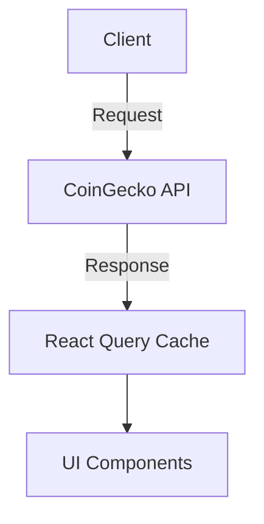

# Crypto Price Tracker Documentation

## Project Setup Guide

### Prerequisites
- Node.js v18+
- npm v9+
- Git
- CoinGecko API account (free tier)

### Web Application Setup
1. Clone the repository:
```bash
git clone https://github.com/yourusername/crypto-price-tracker.git
cd crypto-price-tracker
```

2. Install dependencies:
```bash
npm install
```

3. Start development server:
```bash
npm run dev
```

4. Access the application at:
```bash
http://localhost:3000
```

### Mobile Application (Placeholder)
```bash
cd mobile && npx expo start
```

## API Integration

### Data Flow Architecture


### Key Implementation Details
- **API Endpoint**: `https://api.coingecko.com/api/v3/coins/markets`
- **Default Parameters**:
  ```javascript
  {
    vs_currency: 'usd',
    per_page: 5,
    price_change_percentage: '24h'
  }
  ```
- **Data Fetching**:
  ```javascript
  const fetchCryptos = async () => {
    const response = await fetch(
      `https://api.coingecko.com/api/v3/coins/markets?vs_currency=usd&per_page=5`
    );
    if (!response.ok) throw new Error('Failed to fetch');
    return response.json();
  };
  ```
- **Refresh Mechanism**:
  - Manual refresh via button click
  - Automatic stale-while-revalidate pattern
  - Cache invalidation after 60 seconds

## State Management

### React Query Implementation Rationale
| Criteria        | React Query | Context API | Zustand |
|-----------------|-------------|-------------|---------|
| Cache Management| ✅ Automatic | ❌ Manual    | ❌ Manual |
| Deduped Requests| ✅           | ❌           | ❌       |
| Mutation Support| ✅           | ❌           | ⚠️ Basic |
| DevTools        | ✅           | ❌           | ✅       |

**Key Advantages Chosen**:
1. Built-in request deduplication
2. Automatic cache invalidation
3. Background refetching
4. Pagination support
5. Error handling unification

### Implementation Example
```javascript
const { data, isLoading, isError } = useQuery({
  queryKey: ['cryptos', searchTerm],
  queryFn: () => fetchCryptos(searchTerm),
  staleTime: 60 * 1000,
  refetchOnWindowFocus: false
});
```

## Challenges & Solutions

### 1. API Rate Limiting
**Challenge**: CoinGecko's free tier (10-30 calls/minute)  
**Solution**:
- Implemented client-side caching
- Added request debouncing
- Error fallback UI
```javascript
{isError && <div className="error-banner">API rate limit exceeded</div>}
```

### 2. Real-time Price Updates
**Challenge**: Manual vs automatic refresh balance  
**Solution**: Hybrid approach
- Background stale-while-revalidate
- Manual refresh button with cooldown
- Visual loading states
```javascript
<button 
  disabled={isRefetching}
  onClick={() => refetch()}
>
  {isRefetching ? 'Refreshing...' : 'Refresh'}
</button>
```

### 3. Search Performance
**Challenge**: Filtering large datasets  
**Solution**:
- Memoized search filtering
- Debounced input handling
```javascript
const debouncedSearch = useDebounce(searchTerm, 300);

useEffect(() => {
  refetch();
}, [debouncedSearch]);
```

### 4. UI Consistency
**Challenge**: Responsive table rendering  
**Solution**:
- Tailwind CSS breakpoints
- Horizontal scroll container
- Fixed header positioning
```html
<div className="overflow-x-auto">
  <table className="min-w-full">
    <!-- Table content -->
  </table>
</div>
```

### 5. Error Boundary
**Challenge**: API failure handling  
**Solution**: React Error Boundary implementation
```javascript
class ErrorBoundary extends Component {
  state = { hasError: false };
  
  static getDerivedStateFromError() {
    return { hasError: true };
  }

  render() {
    return this.state.hasError ? (
      <ErrorFallback />
    ) : this.props.children;
  }
}
```

## Future Improvements
1. Implement WebSocket for real-time updates
2. Add currency conversion support
3. Create price change visualization
4. Add unit/integration tests
5. Implement mobile-responsive design